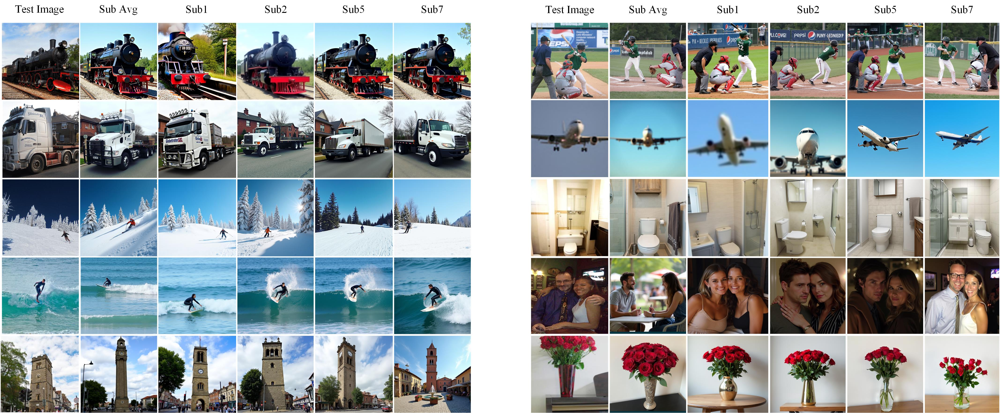
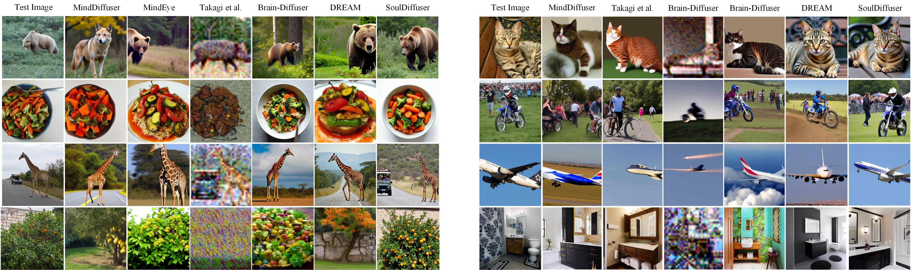

# Code is about to be open-sourced ：SoulDiffuser

## OverView

<div style="text-align: justify; line-height: 1.6;">
In the field of neuroscience, the reconstruction of natural images from fMRI signals has remained a central research challenge. Existing approaches typically flatten volumetric fMRI data into lower-dimensional representations, which leads to a loss of spatial information, compromising reconstruction accuracy and interpretability. Unlike prior methods that rely on such flattened representations, our proposed approach preserves the 3D structure of fMRI signals, enabling more accurate alignment between brain activity and visual features. Moreover, diffusion models often lack precise semantic guidance, resulting in incomplete recovery of key features such as object details, shapes, and color. To address these limitations, we introduce the SoulDiffuser model, which comprises two components: a training pipeline and an inference pipeline. In the training phase, we preserve the 3D structure of fMRI signals and establish a joint spatial relationship between fMRI data and stimulus images. Additionally, inspired by the dual-stream hypothesis—which posits separate dorsal and ventral pathways for distinct visual information processing—SoulDiffuser provides precise semantic guidance through the ventral visual cortex and extracts color and texture information from the early visual cortex and ventral stream. During inference, the model uses multimodal inputs, including visual, textual, and color-texture data, to guide the diffusion process, generating high-quality images that align with visual cognition. Experimental results demonstrate that SoulDiffuser significantly outperforms existing state-of-the-art models both qualitatively and quantitatively on the Natural Scenes Dataset benchmark, further underscoring the impact of retaining volumetric data and dual-stream insights for enhanced image reconstruction.
</div>


## Requirements

A suitable conda environment named SoulDiffuser can be created and activated with:
```bash
conda env create -f environment.yaml
conda activate SoulDiffuser
```

## Reuslts



## Data Availability

The **SoulDiffuser** model was evaluated using the **Natural Scenes Dataset (NSD)**. The dataset and the necessary code to access it are available in the NSD repository. You can access the dataset and related information at [http://naturalscenesdataset.org](http://naturalscenesdataset.org).

## Acknowledgments

The authors would like to express their gratitude for the support provided by the **National Key Research and Development Program of China** (No. 2024YFE0210600), the **National Natural Science Foundation of China** (No. 62373343), and the **Beijing Natural Science Foundation** (No. L233036).


